# 1
- 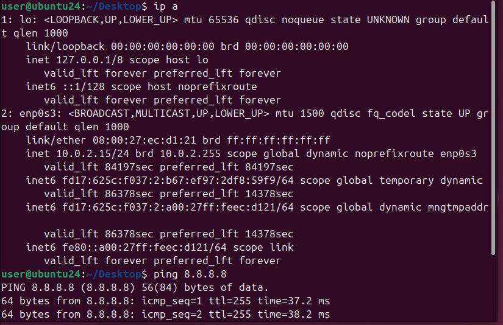\
  *Виртуалка имеет связь с вснешним миром.*

&nbsp;

- 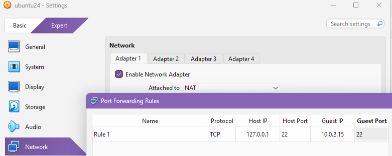\
  *Проброс порта в виртуалку для доступа снаружи через ssh*

&nbsp;

- 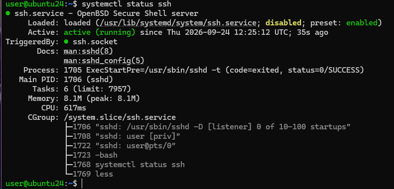\
  *ssh сервер скачан и запущен*

&nbsp;

- 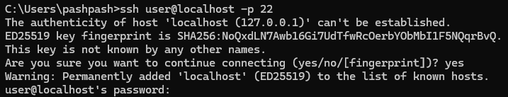\
  *Вход по ssh извне*

&nbsp;

- 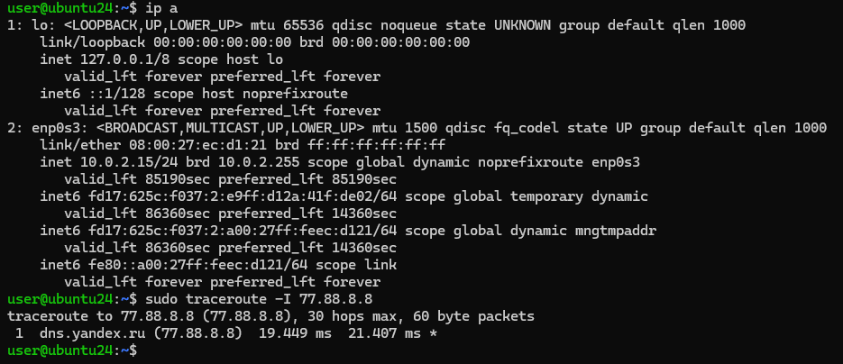\
  *ip a и traceroute*

&nbsp;

- 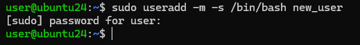\
  *Создание нового пользователя*

&nbsp;

- 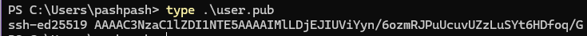\
\
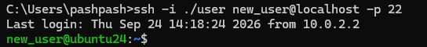\
 *Добавляем публичный ключ в вируталку и успешно заходим по ssh ключу*

&nbsp;

- 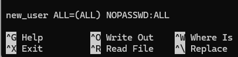\
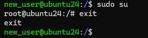\
  *Добавляем в /etc/sudoers и дописываем строку, затем проверяем*

&nbsp;

- 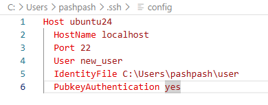\
  *Настройка входа по ssh в VSCode*

&nbsp;

- 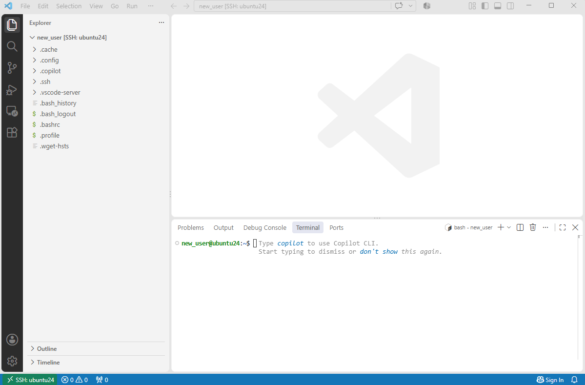
  *Вход в VSCode по ssh*